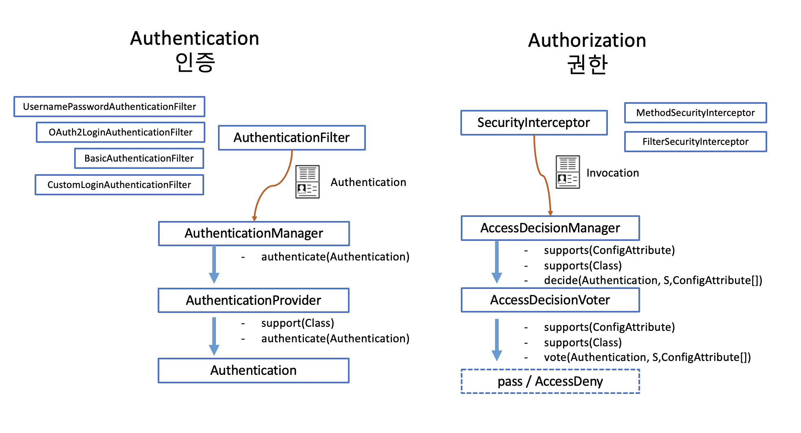

# 스프링 시큐리티의 권한

인증이 모든 요청에 대해 공통적으로 처리해야 하는 것인데 반해 권한은 상황상황에 맞게 처리해야 하는 특징이 있습니다. 그래서 인증을 처리하는 코드는 필터와 어울리고, 권한은 interceptor 와 어울려 작동합니다. 필터는 servlet container 가 제공하는 구조를 스프링이 자체 filterchain 을 만들어서 관리하는 방식으로 처리하고 있고, interceptor 는 스프링이 빈을 등록하고 프락시 객체를 가지고 엮어주는 과정에서 각 point cut에 interceptor 를 제공하는 메커니즘으로 작동합니다. 필터 위에 상주하는 Interceptor 를 FilterSecurityInterceptor라 하고 Method 위에 annotation의 형태로 상주하는 Interceptor 를 MethodSecurityInterceptor 라고 합니다.
그런데 권한을 체크하려면 다음의 정보가 필요합니다.

- 접근하려고 하는 사람이 어떤 접근 권한을 가지고 있는가?

  - GrantedAuthority

- 접근하려고 하는 상황에서는 체크해야 할 내용은 무엇인가?

  - SecurityMetadataSource, ConfigAttribute
  - 정적인 경우와 동적인 경우
  - AccessDecisionVoter

- 여러가지 판단 결과가 나왔을 때 취합은 어떤 방식으로 할 것인가?

  - AccessDecisionManager

  

- 스프링 시큐리티에서 인증(Authentication)과 권한(Authorization)은 두 개의 큰 축입니다.
-

- 인증이 Filter 영역에서 구현되는 반면 권한은 Filter 영역과 servlet 영역에서 모두 구현되어 적용됩니다.
- 인증이 AuthenticationFilter 를 가지고 Authentication을 발급해주는 관계였다면, 권한은 SecurityInterceptor 에서 Access Granted 와 Denied 를 판정하는 결과를 만들어 내는 대응 관계를 가지고 있습니다.
- 인증이 제공해 주는 권한과 각 Interceptor가 위치한 포인트의 조건들(ConfigAttribute) 들을 가지고 판정을 내려주는 Voter 들에 따라 Granted / Denied 가 구분이 됩니다. 그렇지만 권한은 인증보다 훨씬 상황이 다양하다고 볼 수 있습니다.

## AccessDecisionManager : 권한 위원회

- SecurityFilerChain 당 한개의 AccessDecisionManager 를 둘 수 있습니다.
- AffirmativeBased : 한개라도 허가하면 허가됨.
- ConsensusBased : 다수결
- UnanimouseBased : 만장일치

## AuthenticatedVoter

- fully authenticated
- remember me
- anonymous

## RoleVoter

- ROLE_xxx : GrantedAuthority
- 권한 계층 선언

## WebExpressionVoter

- SpEL 로 표현한 권한식

## PreInvocationAuthorizationVoter

## AccessDecisionVoter

- 권한 심사 위원회에 참여하는 투표자
- 결정
  - ACCESS_GRANTED : 허가
  - ACCESS_DENIED : 불허
  - ACCESS_ABSTAIN : 보류

# Granted Authority

- Role
  - Role\_ 로 시작하는 권한으로 변환해줌.
- Authority

### 참고 자료

- https://www.baeldung.com/spring-security-custom-voter
