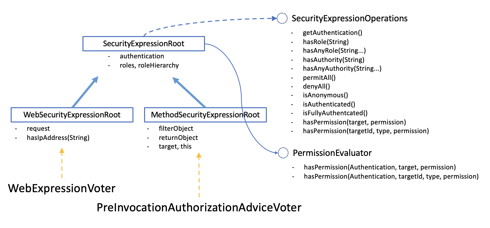

# 권한 처리

권한은 기본적으로 AccessDecisionManager 를 구현해서 처리할 수 있습니다. 하지만 기존에 잘 구현된 소스들을 사용하려면 Voter 기반의 AccessDecisionManager 를 사용하는 것이 좋습니다. 기존의 구현체는 아래의 세가지가 있습니다.

- AccessDecisionManager : 권한 위원회
  - AffirmativeBased : 긍정 위원회
  - ConsensusBased : 다수결 위원회
  - UnanimouseBased : 만장일치 위원회

각각의 기능은 각 클래스의 decide() 메소드를 보면 쉽게 확인할 수 있습니다.

Voter 기반의 AccessDecisionManager 를 이해하려면 각 Voter 들이 어떻게 동작하는지 알고 있는 것이 좋습니다.

## Granted Authority

- Role
  - Role\_ 로 시작하는 권한으로 변환해줌.
  - Role Hierarchy 장치를 사용할 수 있음.
- Authority
  - 다양한 권한을 설계할 수 있는 유연한 구조임.

## AccessDecisionVoter

- 권한 심사 위원회에 참여하는 투표자
- 결정
  - ACCESS_GRANTED : 허가
  - ACCESS_DENIED : 불허
  - ACCESS_ABSTAIN : 보류

## 필터에서 권한 체크하기

WebSecurityConfigurarAdapter 에서 설정합니다.

```java

  // HttpSecurity 에 설정
  @Override
  protected void configure(HttpSecurity http) throws Exception {
    http
      ...
      .authorizeRequests(
        authority->authority
          .antMatchers("/admin/**").hasRole("ADMIN")
          .mvcMatchers("/greeting/{name}")
              .access("@nameCheck.check(#name)")
          .anyRequest().authenticated()
      )
      ...
      ;
    }
```

- 필터는 보안의 1차 방어선이기 때문에 필터에서 최대한 막을 수 있다면 막는 것이 유리합니다.
- 필터에서 사용하는 Voter는 별도 세팅하지 않는다면 WebExpressionVoter만 사용합니다.

### WebExpressionVoter

- 필터에서 설정하는 voter (FilterInvocation)
- SpEL 로 표현한 권한식
- WebSecurityExpressionRoot 를 사용합니다.
- Bean 객체를 만들고 호출해서 사용할 수 있습니다.
  - @빈이름을 사용해 빈에 접근
- URL 에 path variable 을 선언해서 체크할 수 있습니다.
  - \# 으로 변수 이름에 접근



## 메쏘드에서 권한 체크 하기

- GlobalMethodSecurityConfiguration 에서 AccessDecisionManager 를 설정합니다.
- 아래와 같은 표현식을 사용할 수 있다.

| 표현식                                                               | 의미                                                                                                                                                     |
| -------------------------------------------------------------------- | :------------------------------------------------------------------------------------------------------------------------------------------------------- |
| hasRole(String role)                                                 | princial 이 해당 role을 가지고 있으면 true                                                                                                               |
| hasAnyRole(String... roles)                                          | principal 이 제시한 role 중에 한개라도 있으면 true.                                                                                                      |
| hasAuthority(String authority)                                       | principal 이 제시한 authority를 가지고 있으면 true                                                                                                       |
| principal                                                            | 인증서의 principal 객체에 바로 접근 가능                                                                                                                 |
| permitAll                                                            | 모두 허용                                                                                                                                                |
| denyAll                                                              | 모두 거부                                                                                                                                                |
| isAnonymous()                                                        | 익명사용자                                                                                                                                               |
| isRememberMe()                                                       | 자동 로그인 사용자                                                                                                                                       |
| isAuthenticated()                                                    | 익명사용자가 아니면 true                                                                                                                                 |
| isFullyAuthenticated()                                               | 익명사용자나 자동로그인한 사용자가 아니면 true                                                                                                           |
| hasPermission(Object target, Object permission)                      | Returns true if the user has access to the provided target for the given permission. For example, hasPermission(domainObject, 'read')                    |
| hasPermission(Object targetId, String targetType, Object permission) | Returns true if the user has access to the provided target for the given permission. For example, hasPermission(1, 'com.example.domain.Message', 'read') |

### 1. PreInvocationAuthorizationAdviceVoter

- @PreAuthorize 애노테이션을 처리합니다.
- WebExpressionVoter 처럼 SpEL 을 사용할 수 있습니다.
- SecurityExpressionHandler가 MethodSecurityExpressionRoot 를 사용해 표현식을 처리합니다.

### 2. AuthenticatedVoter

인증(통행증)을 받았다면 그 인증의 종류가 어떤 종류인지를 판단합니다. 이제 막 인증을 받고 들어온 사용자와 RememberMe 토큰을 통해서 들어온 사용자와 익명 사용자를 구분하기 위해 쓰입니다. RememberMe 인증 사용자는 탈취된 토큰을 가지고 들어온 사용자일 수 있기 때문에 필요한 경우 한번 더 인증을 요구할 수 있습니다.

- fully authenticated
- remember me
- anonymous

### 3. RoleVoter

Role 기반의 권한은 리눅스부터 아파치, 톰켓등 IT 초기부터 전통적으로 구현해서 사용하던 가장 직관적인 권한 체계입니다. 하지만, Role 을 기반으로 권한을 판단하기엔, 상황이 너무 다양해졌죠. 그래서 Role 을 확장한 Authority 기반의 권한 체계를 사용하고 있습니다. 그렇지만, 기존의 Role 기반이 가지고 있는 직관적이고 계층적인 사용성을 그대로 사용할 수 있도록 해주기 위해 RoleVoter가 쓰입니다.

- ROLE_xxx : GrantedAuthority
- 권한 계층 선언 : RoleHierarchyVoter


