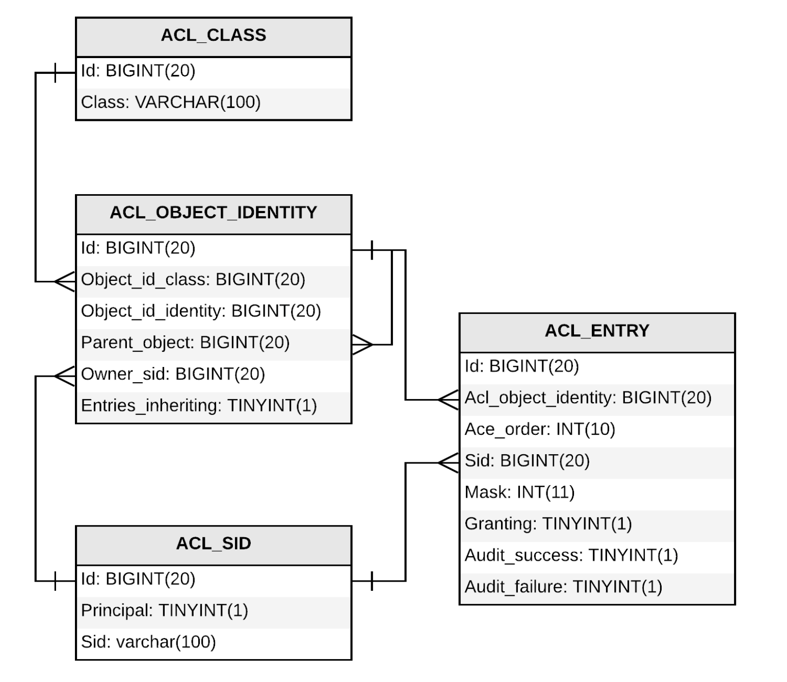

# AOP 를 활용한 동적 권한 설계

권한 체크가 단순한 권한(Authority)만으로 어려운 복잡한 경우가 있을 수 있습니다.

아래는 Spring Security 스펙에서 ACL이 필요한 경우를 설명하기 위해 만든 권한 체크의 3요소 입니다.

- 누가 (Authentication)
- 어떤 메소드에서 (MethodInvocation)
- 어떤 객체에 접근할 수 있는지 (DomainObject) => ACL

이를 위해, spring-security-acl 모듈이 간단한 접근권한과 관련해 표준 DB 모델을 만들어서 제공 하고 있습니다.

아래는 spring-security-acl이 제공하는 것으로 접근 정보를 DB화 하고 있습니다. 실제로 이 모델을 사용해서 구현하는 것은 매우 까다롭고 어려운 일입니다. 현업에서도 거의 사용하지 않는 기술입니다. 하지만 그 기술적인 기반을 알아보는 것은 의미가 있습니다. 이 기술이 어떤 장점과 단점을 가지고 있는지 알아야 하기 때문입니다.

## ACL 도메인 모델

- ACL_CLASS : 도메인 객체의 종류. 보통은 class 로 매핑되는 id 값을 조회 합니다.
- ACL_SID : principal. 권한의 주체가 되는 사용자 정보와 Role 정보
- ACL_OBJECT_IDENTITY : 보안의 대상이 되는 정보 객체. 트리 구조로 되어 있습니다.
  - Id : ACL_CLASS 의 id 값
  - 어느 클래스의 어느 객체이고 생성자가 누구인지에 대한 정보를 갖는다.
- ACL_ENTRY : 접근 권한 정보
  - Ace_order:
  - Mask : 접근 권한 정보 ( READ,WRITE,ADMIN)

## ACL 기술의 장점

- Spring Security 가 바라보는 관점에서 도메인 객체에 대한 접근성 관리의 표준 모델을 샘플로 제공하고 있다. (Custom ACL 테이블을 구현해서 관리할 수 있는 사례를 보여주고 있다.)
- 도메인 객체의 상태나 관계를 접근성이라는 관심사로 부터 분리할 수 있다. (역으로 관리포인트가 늘어난다.)
- hasPermission 이라는 Expression 을 활용해 접근성 관리를 DB화 해서 사용할 수 있다.

## ACL 기술의 단점

- Domain 객체가 가지고 있는 접근성에 대한 정보를 활용하지 못하고, ACL 테이블을 별도로 관리해주어야 한다.
- 사용자와 도메인 객체가 많아지면, 접근 권한에 대한 경우의 수가 기하급수적으로 늘어난다.
- 기술의 난이도 높아 유지보수가 어렵다.
