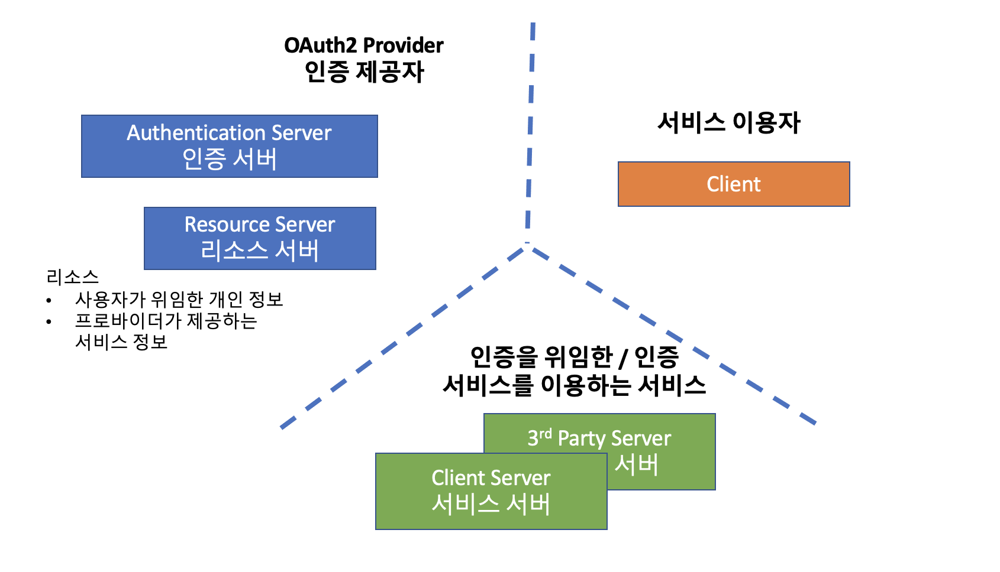

# OAuth2

## CommonOAuth2Provider

- GOOGLE
- GITHUB
- FACEBOOK
- OKTA

## 추가 가능한 OAuth2Provider ...

- naver
- kakao

## OAuth2User

- facebook, naver, kakao
- OAuth2User : UserDetails 를 대체합니다.
- OAuth2UserService : UserDetailsService 를 대체합니다. 기본 구현체는 DefaultOAuth2UserService 입니다.

## OidcUser

- google
- OidcUser
- OidcUserService : OAuth2UserService 를 확장한 서비스
