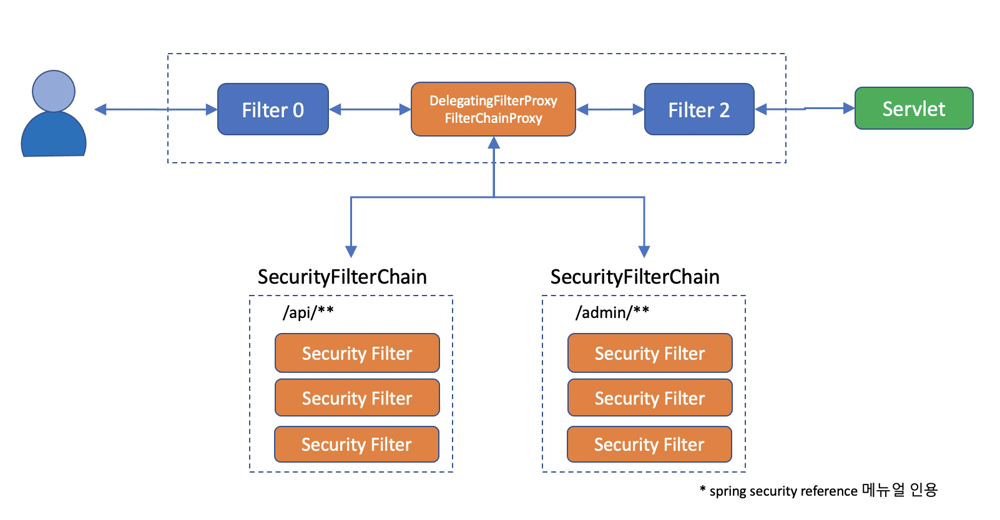
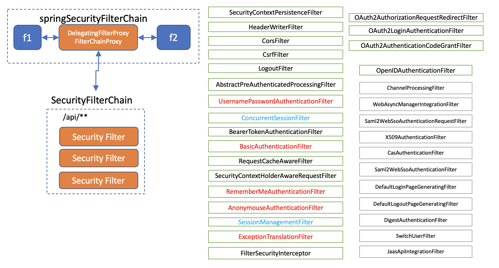
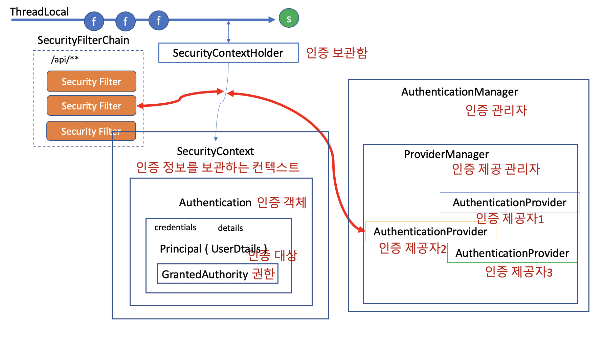

# 스프링 시큐리티의 큰 그림

## 서블릿 컨테이너

- 톰켓과 같은 웹 애플리케이션을 서블릿 컨테이너라고 부르는데, 이런 웹 애플리케이션(J2EE Application)은 기본적으로 필터와 서블릿으로 구성되어 있다.

- 필터는 체인처럼 엮여있기 때문에 필터 체인이라고도 불리는데, 모든 request 는 이 필터 체인을 반드시 거쳐야만 서블릿 서비스에 도착하게 되어 있다.

## 스프링 시큐리티의 큰 그림

- 그래서 스프링 시큐리티는 DelegatingFilterProxy 라는 필터를 만들어 메인 필터체인에 끼워넣고, 그 아래 다시 SecurityFilterChain 그룹을 등록한다.

- 이 필터체인은 반드시 한개 이상이고, url 패턴에 따라 적용되는 필터체인을 다르게 할 수 있다. 본래의 메인 필터를 반드시 통과해야만 서블릿에 들어갈 수 있는 단점을 보완하기 위해서 필터체인 Proxy 를 두었다고 할 수 있다.
- web resource 의 경우 패턴을 따르더라도 필터를 무시(ignore)하고 통과시켜주기도 한다.

## 시큐리티 필터들

- 이 필터체인에는 다양한 필터들이 들어간다.

- 각각의 필터는 단일 필터 단일 책임(?) 원칙 처럼, 각기 서로 다른 관심사를 해결한다. 예를 들면 아래와 같다.
  - _HeaderWriterFilter_ : Http 해더를 검사한다. 써야 할 건 잘 써있는지, 필요한 해더를 더해줘야 할 건 없는가?
  - _CorsFilter_ : 허가된 사이트나 클라이언트의 요청인가?
  - _CsrfFilter_ : 내가 내보낸 리소스에서 올라온 요청인가?
  - _LogoutFilter_ : 지금 로그아웃하겠다고 하는건가?
  - _UsernamePasswordAuthenticationFilter_ : username / password 로 로그인을 하려고 하는가? 만약 로그인이면 여기서 처리하고 가야 할 페이지로 보내 줄께.
  - _ConcurrentSessionFilter_ : 여거저기서 로그인 하는걸 허용할 것인가?
  - _BearerTokenAuthenticationFilter_ : Authentication 해더에 Bearer 토큰이 오면 인증 처리 해줄께.
  - _BasicAuthenticationFilter_ : Authentication 해더에 Basic 토큰을 주면 검사해서 인증처리 해줄께.
  - _RequestCacheAwareFilter_ : 방금 요청한 request 이력이 다음에 필요할 수 있으니 캐시에 담아놓을께.
  - _SecurityContextHolderAwareRequestFilter_ : 보안 관련 Servlet 3 스펙을 지원하기 위한 필터라고 한다.(?)
  - _RememberMeAuthenticationFilter_ : 아직 Authentication 인증이 안된 경우라면 RememberMe 쿠키를 검사해서 인증 처리해줄께
  - _AnonymouseAuthenticationFilter_ : 아직도 인증이 안되었으면 너는 Anonymouse 사용자야
  - _SessionManagementFilter_ : 서버에서 지정한 세션정책을 검사할께.
  - _ExcpetionTranslationFilter_ : 나 이후에 인증이나 권한 예외가 발생하면 내가 잡아서 처리해 줄께.
  - _FilterSecurityInterceptor_ : 여기까지 살아서 왔다면 인증이 있다는 거니, 니가 들어가려고 하는 request 에 들어갈 자격이 있는지 그리고 리턴한 결과를 너에게 보내줘도 되는건지 마지막으로 내가 점검해 줄께.
  - 그 밖에... OAuth2 나 Saml2, Cas, X509 등에 관한 필터들도 있다.
- 필터는 넣거나 뺄 수 있고 순서를 조절할 수 있다. (이때 필터의 순서가 매우 critical 할 수 있기 때문에 기본 필터들은 그 순서가 어느정도 정해져 있다.)

---

## Authentication

- 필터들 중에 일부 필터는 인증 정보에 관여한다. 이들 필터가 하는 일은 AuthenticationManager 를 통해 Authentication 을 인증하고 그 결과를 SecurityContextHolder 에 넣어주는 일이다.

  - UsernamePasswordAuthenticationFilter
  - BearerTokenAuthenticationFilter
  - BasicAuthenticationFilter
  - OAuth2LoginAuthenticationFilter

- Authentication 을 제공(Provide) 하는 인증제공자는 여러개가 동시에 존재할 수 있고, 인증 방식에 따라 ProviderManager 도 복수로 존재할 수 있다.
- Authentication 은 인터페이스로 아래와 같은 정보들을 갖고 있다.
  - _Set&lt;GrantedAuthority&gt; authorities_ : 인증된 권한 정보
  - _principal_ : 인증 대상에 관한 정보. 주로 UserDetails 객체가 온다.
  - _credentials_ : 인증 확인을 위한 정보. 주로 비밀번호가 오지만, 인증 후에는 보안을 위해 삭제한다.
  - _details_ : 그 밖에 필요한 정보. IP, 세션정보, 기타 인증요청에서 사용했던 정보들.
  - _boolean authenticated_ : 인증되었는가?
